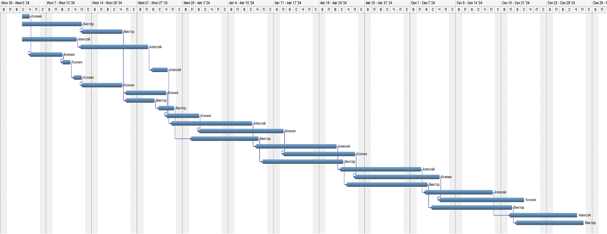
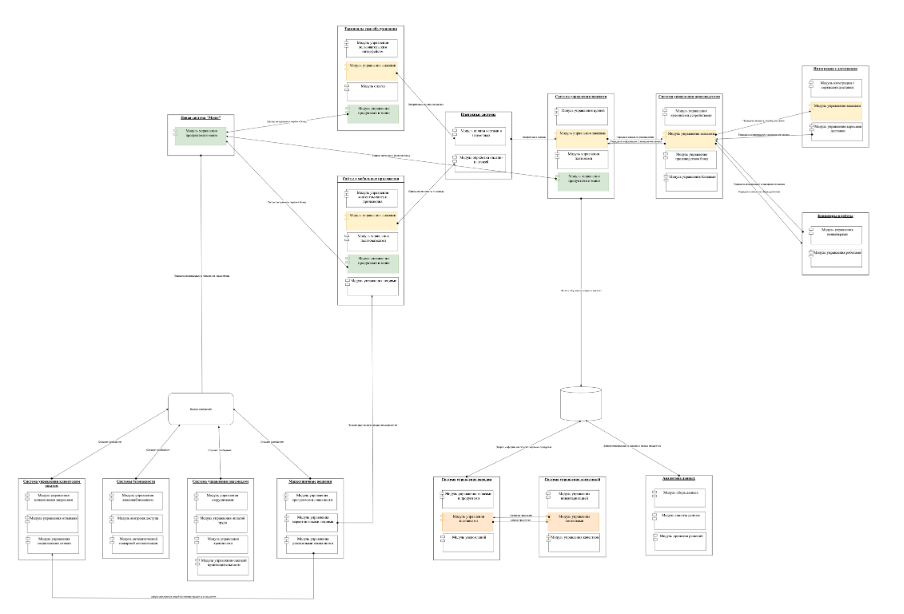

= Проект по разработке системы внедрения новых продуктов в сети столовых "Замысловатость"

== Общая информация
Внедрение автоматизации при добавлении новых продуктов в сети закусочных «Замысловатость»»

== Цели внедрения проекта
Реализация механизмов упрощенного внедрения новых продуктов в сети межконтинентальных закусочных “Замысловатость”

== Описание проекта
Ключевой подход: 
необходимо разработать новую систему «Меню», в которой можно создавать (редактировать, архивировать) карточки блюд в меню, также настроить интеграцию с другими системами по предоставлению нового продукта клиентам закусочной.

Для процесса разработки выбираем Scrum методологию. 

Планируем выполнение следующих задач:

* Описание общего бизнес-процесса,
* Атрибутивный состав карточки блюда,
* База данных,
* Функциональные требования к карточке блюда,
* Функциональные требования к списку блюд,
* Нефункциональные требования,
* Статусная модель,
* Авторизация, регистрация в системе "Меню",
* Ролевая модель карточки блюда,
* Визуальная форма карточки блюда,
* Визуальная форма списка блюд,
* Положительные сценарии,
* Отрицательные сценарии,
* Описание общей архитектуры,
* Интеграция  c 14 системами (с сайтами и мобильными приложениями, терминалами обслуживания, системой управления заказами, производством, складом, логистикой, персоналом, клиентским опытом, платежными системами, системой аналитики данных, доставкой, маркетингом, системой безопасности, конвейеры и роботы)

Все задачи проекта можно посмотреть по https://artenova.atlassian.net/jira/projects[ссылке] 

== Roadmap проекта

== Команда проекта

.Команда проекта
[cols="2*", options="header"]  
|=== 
|Должность|Количество
|Team Lead системных аналитиков|1
|Системный аналитик|3
|BE Разработчик|2
|FE Разработчик|1
|Тестировщик|1
|Руководитель проекта|1
|===

== Риски проекта

.Риски проекта
[cols="1;3;3;3", options="header"]  
|=== 
|№|Вид риска|Степень влияния|Вероятность наступления
|1|Недостаточное тестирование и отладка системы|5|1
|2|Изменение требований и области проекта в процессе работы|4|2
|3|Недостаточная поддержка и документация по интеграции|5|5
|4|Недоверие пользователей к новой системе и нежелание изменять рабочие процессы|3|3
|5|Трудности в обеспечении безопасности и защиты информации при использовании технологий|1|1
|===

== Описание выбранного решения

Для проекта выбрана смешанную архитектуру SOA + EDA.

SOA: Каждая система имеет свои модули, микросервисы (есть несколько единых сервисов), основная информация по заказам складывается в единую БД, от куда берут данные другие системы в реальном времени. Это обеспечивает инкапсуляцию (изоляция друг от друга бизнес функций), высокую степень детализации. Однако есть недостаток – сложная кооперация.

EDA: есть брокер сообщений для отправку туда данных об обновление блюда в меню, а также есть несколько систем, которые слушают сообщения. Это позволяет распределят нагрузку сервисов, а также сохранять данные об изменение меню. Однако есть недостаток – новый участник брокер сообщения, отложенная синхронизация (но для потребителей некритично моментальное получение информации, планируется смена блюд в меню не так часто).

== Описание архитектуры с НФТ

Изображение архитектуры 

Создана новая система «Меню» с модулем управления продуктами и меню.

1) Через данный модуль происходит запрос актуального перечня блюд системами: Терминалы самообслуживания, Сайты и мобильные приложения, Системы управления заказами.

Терминалы самообслуживания и Сайты и мобильные приложения оформляют оплату по заказу и передают ее в систему Платежные системы -> Платежные системы после успешной оплаты передают заказ дальше в Систему управления заказами-> Система управления заказами передает заказ в Систему управления производством-> Система управления производством изготавливает сама заказ или передает на производство робота (если самообслуживания), если заказ на доставку – то передает заказ в доставку и ждет информации о завершение заказа-> Система управления производством после получения информации, что заказ завершено, передает информацию в Систему управления заказами->Система управления заказами записывает информацию о заказе в БД

Система управления складом ежедневно запрашивает информацию об использованных продуктах из БД->Если товаров на складе недостаточно, то отправляет запрос на закупку продуктов в Систему управления логистикой-> Система управления логистикой закупает продукты и отвозит их на склад

Система Аналитика данных берет данные о завершенных заказах из БД и анализирует их

2) Новая система «Меню» отправляет информацию о появление нового продукта в Брокер сообщения
Система управления клиентским опытом, Система безопасности, Система управления персоналом, Система Маркетинговые решения слушают сообщения.
Маркетинговые решения придумывают новые акции и направляют их на Сайты и мобильные приложения, а также Маркетинговые решения направляют рекламные акции в Систему управления клиентским опытом для запуска ее в соц сетях.

.Нефункциональные требования
[options="header"]
|===
|Требование |Атрибут 
|Доступность 24/7	| Количество пользователей в дневное время - 1000, в ночное - 100
|Минимальное время простоя	| Время восстановление не превышает 3х секунд 
|Быстрый доступ к системе	| Страницы загружаются не более 2х секунд. 
|Быстродействие	|  Выполнение операций длится не более 2х секунд (добавление в корзину, оформление заказа) 
|Отзывчивость системы	| Система моментально откликается на выполненные действия (не более 0,3 секунды) 
|Минимальное время ответа на запрос	|   Среднее время ответа на запрос не превышает 0,5 секунд
|Количество ошибок	|  Количество ошибок не превышает 0,5% от всех выполненных запросов
|Время восстановления после отказа системы	| Время восстановление не превышает 10 минут 
|Защита от сбоев	|  Минимальное количество дней без сбоев = 10.
|Добавление новых точек входа для создания заказов	|  Добавление новых точек входа для создания заказа занимает не более 10и рабочий дней.
|Горизонтальное масштабирование (увеличение мощности при увеличении количества заказов)	|  Система автоматически добавляет ресурсы на сервер при увеличении количества заказов в минуту (увеличение на каждые 500 заказов)
|Противостояние несанкционированному доступу	|  Отсутствует несанкционированный доступ к чувствительным данным
|Целостность данных	|  Система выдерживает ДДОС-атаку до 1 ГБ в секунду
|===

== Заключение

Реализация этого проекта позволит многократно сократить время на внедрение новых продуктов сети наших закусочных, что положительно скажется на уровне лояльности наших клиентов, а так же повысит уровень нашей конкурентоспособности, что в итоге приведет к росту выручки.